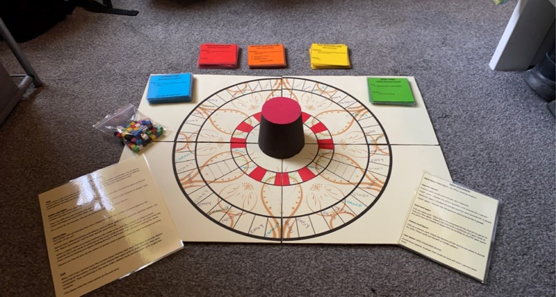

<!-- Project Information -->

  <h1>Volcania:</h1>
  <h3>🎮Game Description:</h3>
  <h4>Volcania is a 2-6 player trivial board game with a goal of saving as many people from the erupting volcano. Although this unit was the creation of a physical board game, it gave me the basic skills in order to design and develop any game from the ground up.</h4>
  <h3>‼️Respsonsibilities:</h3>
  <ul>
    <li>Constructing each draft & the final version of the project
    <li>Managing tasks and deadlines for the whole team
    <li>Ensuring the overall project was on track
  </ul>
  <h3>⭐Project Summary:</h3>
  <ul>
    <li>Team: 3 Members
  </ul>

<!-- Project Image/Gif -->

  

