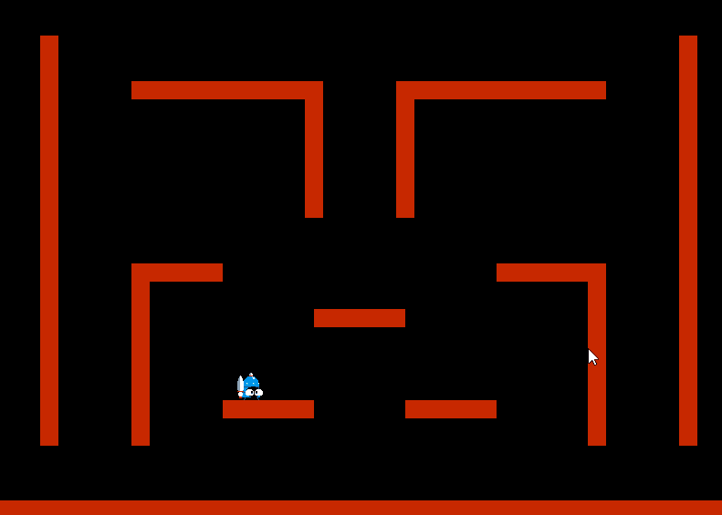

<!-- Project Information -->

  <h1>Games Programming - C++ Game:</h1>
  <h3>🎮Game Description:</h3>
  <h4>For this project I had to complete a series of tasks on an existing project in SFML. The tasks completed are listed below.:</h4>
  <ul>
    <li>Debugging & refactoring code
    <ul>
      <li> Collision class
      <li> State pattern
    </ul>
    <li>Animation script (for the player)
    <li>Wall jumping & sliding script
  </ul>
  <h3>⭐Project Details:</h3>
  <ul>
    <li>Team: Solo
    <li>Language: C++
    <li>Library: SFML
  </ul>
  

<!-- Project Image/Gif -->

  

